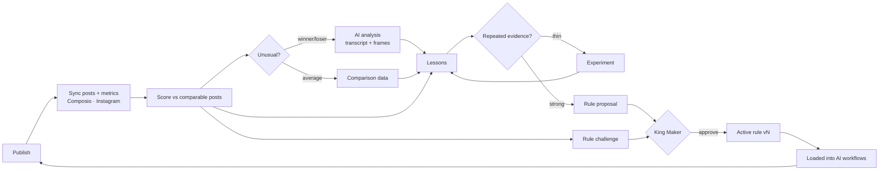

# BBO BRAIN

**BBO's institutional memory and self-improving content operating system.**

Not an analytics dashboard. BBO BRAIN exists to answer two questions:

1. *What has BBO learned from everything BBO has already posted?*
2. *What should BBO do next because of those lessons?*

Everything in the product serves one loop:

```
CONTENT → PERFORMANCE → LESSON → UPDATED RULE → NEXT CONTENT
```



## Quick start

```bash
cd bbo-brain
npm install
npm run migrate                     # creates data/brain.db and seeds reference data
npm run job -- backfill             # audit archive + audit learnings + full Instagram history + scoring + mining
npm run dev                         # http://127.0.0.1:3200
```

Secrets are read from the repo-root `../.env` and `bbo-brain/.env.local` (see `.env.example`). Nothing is exposed to the browser.

## Daily operation

```bash
npm run job -- daily                # sync → media/transcripts → score → AI coding → analysis → lessons → proposals → challenges → experiments → opportunities → graph → search
npm run job -- weekly-review
npm run job -- list                 # every job and what it does
```

`scripts/launchd/com.bbo.brain.daily.plist` is a **template** for running the loop at 07:30 daily. It is not installed — install it only when you decide to (instructions inside the file). Jobs can also be started from Settings or the Command Center.

## Sections

| Section | Route | Answers |
|---|---|---|
| Command Center | `/` | What needs my attention? |
| What Should BBO Make Next? | `/next` | Ranked, evidence-backed next content |
| Ask BBO | `/ask` | Natural-language questions answered from calculated evidence |
| Weekly / Monthly Review | `/reviews` | What BBO learned this week / month, saved historically |
| Content Library | `/content` | Every post, filterable and sortable |
| Content Detail | `/content/[id]` | Media, transcript, performance context, AI analysis, lessons, rules, experiments, similar winners/losers, attribute overrides |
| Content Intelligence | `/intelligence` | Analysis queue, analyses, attribute coverage |
| Performance | `/performance` | Normalized scoring, trends, franchises, score versions |
| People / Guests | `/people` | How content featuring each person performs |
| Topics | `/topics` | Share drivers, comments-but-weak-retention, saturation, dormant winners |
| Knowledge Graph | `/graph` | Queryable relationships, then a map |
| Lessons | `/lessons` | First-class lessons with belief history |
| BBO Rules | `/rules` | Versioned, scoped rules and open challenges |
| Rule Proposals | `/proposals` | Approve · Edit + approve · Reject · Keep observing |
| Experiments | `/experiments` | Deliberate tests that become lessons |
| Edit Lab | `/edit-lab` | Viral Editor → independent Gatekeeper loop |
| AI Agent Runs | `/runs` | Every model call with prompt, skill, rule and score versions |
| Settings / Integrations | `/settings` | Connections, limitations, jobs, triggers, entity resolution, skills |

## What is real right now

Verified in the build session on 2026-09-15:

- **Instagram (@dabboshow) via Composio** — 951 posts (2021-06-03 → 2026-09-15), 998 API calls, 9,388 metric values, 0 failures; plus 1,677 historical snapshots from 8 weekly-audit runs and 41 account data points.
- **940 posts scored** against comparable BBO posts. **46 lessons**: 12 imported from the weekly audits (with their real belief history) and 34 mined, each with sample sizes, effect, p-value and confidence.
- **Local media + transcripts** via ffmpeg and whisper.cpp; Gemini attribute coding and analysis run through the versioned AI layer.
- **No demo data exists.** The schema has `content.is_demo`, and anything flagged renders with a DEMO DATA badge.

Known limitations are listed plainly on the Integrations page and in `COMPOSIO_INTEGRATIONS.md` — most importantly, Instagram does not expose per-Reel follows, profile visits, or second-by-second retention.

## Documentation

- [ARCHITECTURE.md](ARCHITECTURE.md) — stack, layers, runtime, and how to extend
- [DATA_MODEL.md](DATA_MODEL.md) — tables, invariants, migrations
- [COMPOSIO_INTEGRATIONS.md](COMPOSIO_INTEGRATIONS.md) — what is connected and what each source can really provide
- [AI_SYSTEM.md](AI_SYSTEM.md) — AI workflows, provenance, Gatekeeper, Ask BBO
- [PERFORMANCE_SCORING.md](PERFORMANCE_SCORING.md) — the normalized score and why comparisons are era-normalized
- [EXPERIMENTS.md](EXPERIMENTS.md) — the experiment engine
- [RULE_ENGINE.md](RULE_ENGINE.md) — lessons, proposals, approvals, challenges, statistical guardrails
- [skills/bbo-viral-content/SKILL.md](skills/bbo-viral-content/SKILL.md) · [skills/bbo-gatekeeper/SKILL.md](skills/bbo-gatekeeper/SKILL.md)
- [knowledge/CONSTRAINTS.md](knowledge/CONSTRAINTS.md) — active rules, regenerated from the database

## Development

```bash
npm test            # vitest — 104 tests
npm run typecheck
npm run lint
```

Tests cover ingestion, deduplication, append-only metric history, alias resolution, scoring, winner/loser triggers, Gatekeeper thresholds and retry limits, lesson mining, the rule proposal → approval → challenge flow, experiments, weekly reviews, opportunities, Ask BBO routing and grounding, search, the graph, and sync idempotency. Tests never call a real model or API.
